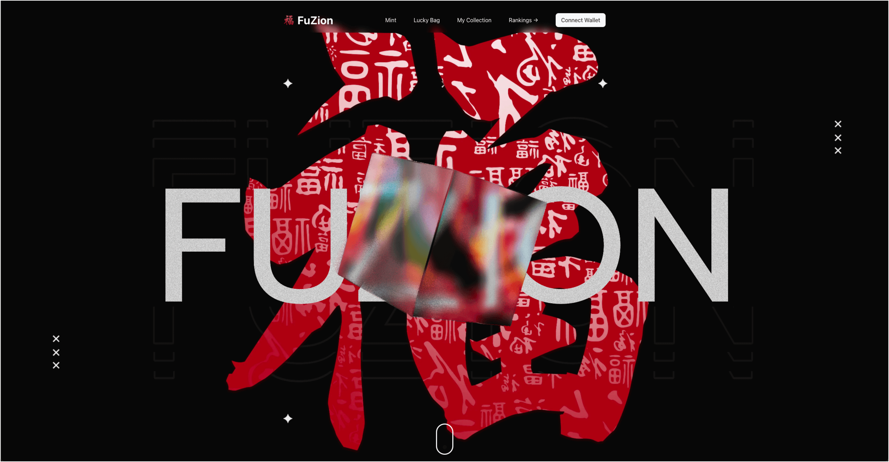

<div align="center">
  <br>
  
  <br>
  <a href="fuzion-sui.vercel.app">
    <h3 align="center">FuZion</h3>
  </a>
  <br>
</div>

<p align="center">
  <a href="#about-the-project">About The Project</a> •
  <a href="#features">Features</a> •
  <a href="#getting-started">Getting Started</a> •
  <a href="#usage">Usage</a>
</p>

## About The Project

<h4 align="center">FuZion is an innovative Sui blockchain dapp where users collect and combine digital "福" characters through a lucky bag mechanic, striving to assemble a complete and auspicious "福" symbol on-chain.</h4>



### Built With


## Features

* Mint digital "福" characters.
* Draw from Lucky Bags to obtain character strokes.
* Collect the right combination to complete your character and unlock the power of "福".
* Assemble all five distinct "福" characters to create a mysterious ultimate NFT!
* Display your collection of 福 characters in your digital wallet or on social media to share your blessings with others.
* Compete with other collectors to see who can complete their 福 characters first.
* Explore More

## Getting Started

### Prerequisites
- [Sui prerequisites](https://docs.sui.io/build/install#prerequisites) (Sui prerequisites only)
- [Suibase](https://suibase.io/how-to/install.html)
- [Node (>= 20)](https://nodejs.org/en/download/)

### Installation
```bash
git clone https://github.com/Tian-Hun/fuzion.git
cd fuzion
bun install
```

## Usage

#### 1. Run the local Sui network:

```bash
localnet start
```

Local Sui Explorer will be available on [localhost:9001](http://localhost:9001/)

#### 2. Deploy the demo contract to the local network:

```bash
localnet publish --path ${PWD}/move/futune
```

#### 3. Switch to the local network in your browser wallet settings.

#### 4. Fund your localnet account/address:

You have a few options here:

a) Use the Faucet button integrated into your wallet (e.g. Sui Wallet).

b) Copy the localnet address from your wallet and run the following in your console:

```bash
pnpm localnet:faucet 0xYOURADDRESS
```

#### 5. Set up environment variables:

```bash
cp .env.example .env
```

Then open the .env file and set the required variables.

#### 6. Run the app:

```bash
bun dev
```

